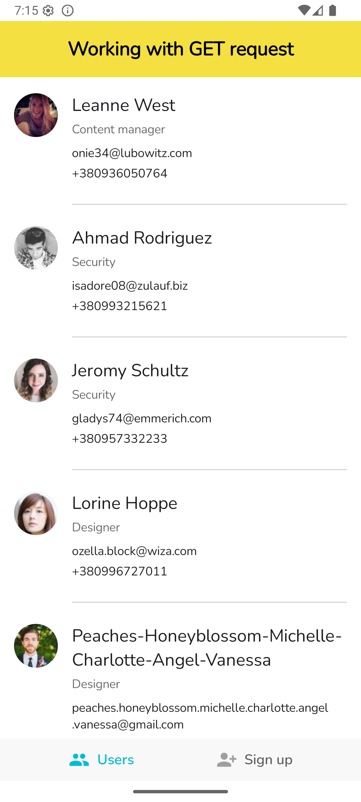
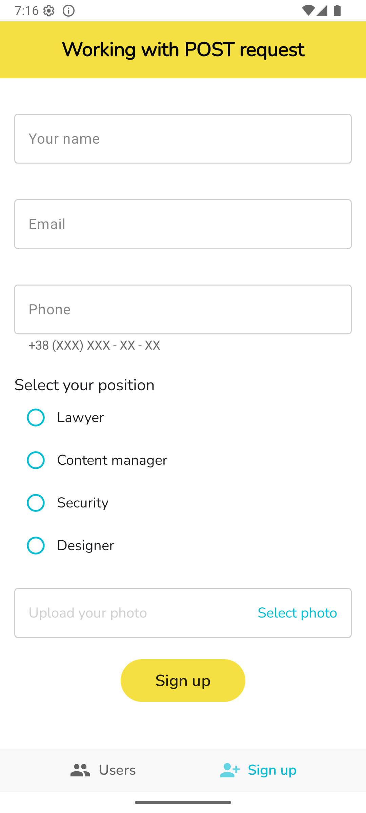
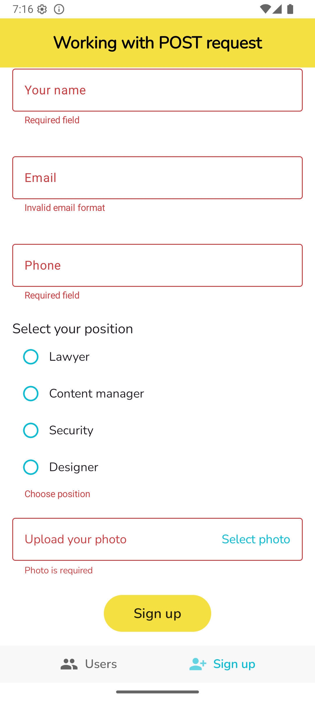
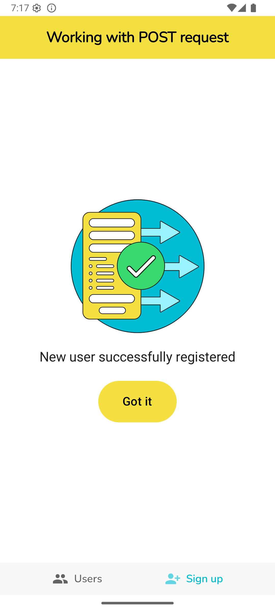

## 📱 TestTask
Multifunctional application with two screens:
1. request and display of the list of users;
2. registration of a new user.

## 🚀 Fast start
```bash
git clone https://github.com/SemenovViktor88/testtask.git
```
Open the project in Android Studio Giraffe or newer and run the app module.

## 🛠 Project characteristics
Tools and solutions and tech-stack:

* [Kotlin](https://kotlinlang.org/)
* [Coroutines](https://kotlinlang.org/docs/reference/coroutines-overview.html)
* [Android Jetpack](https://developer.android.com/jetpack)
* [Retrofit](https://square.github.io/retrofit/)
* [Hilt Android](https://developer.android.com/training/dependency-injection/hilt-android)
* [Jetpack Compose](https://developer.android.com/jetpack/compose)
* [Compose Navigation](https://developer.android.com/jetpack/compose/navigation)
* [Coil](https://coil-kt.github.io/coil/compose/)
* [SplashScreen](https://developer.android.com/develop/ui/views/launch/splash-screen)
* A single-activity architecture
* Architecture
    * `Clean Architecture`
    * `MVVM + MVI`
    * [Jetpack Compose](https://developer.android.com/jetpack/compose)

## 📋 Application features
✅ User registration with full form validation.

✅ Custom form errors and user hints.

✅ Uploading an avatar via the gallery.

✅ Clean separation of layers: data, domain, presentation

## 🏛 Project architecture
```
testtask/
 ├── app/          # Application logic and UI
 ├── data/         # Reposities, API
 ├── domain/       # Repository interfaces, business logic
 └── buildSrc/     # Gradle Version Catalog for dependencies
```

## 📸 Screenshots

| List users | Registration form | Error validate | Registration success |
| ----------------- | ----------------- | ----------------- | ----------------- |
|  |  |  | 
